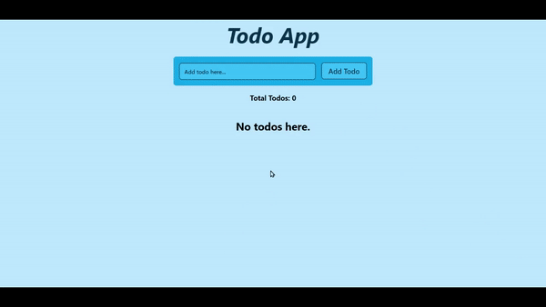

# React Assignment: Todo App using useReducer Hook

### This is a simple Todo app built with React, using the useReducer, useState, and useEffect hooks. It allows you to add, edit, and delete todos.

---

## Features

- Add a new todo item
- Edit an existing todo item
- Delete a todo item
- Todos are stored in localStorage and persist across page reloads

## Technologies Used

1. React
2. useReducer hook
3. useState hook
4. useEffect hook
5. HTML
6. CSS
7. Tailwind CSS

---

## Demo

You can also see a live demo of this project here.

Or click the link below If above button doesn't work:

https://todoapp-react-usereducer-hook-yasir.netlify.app/

## Here is Output Gif/Video:

<!-- 

<video width="640" height="360" controls>
  <source src="./video.mp4" type="video/mp4">
  Your browser does not support the video tag.
</video> -->

---
